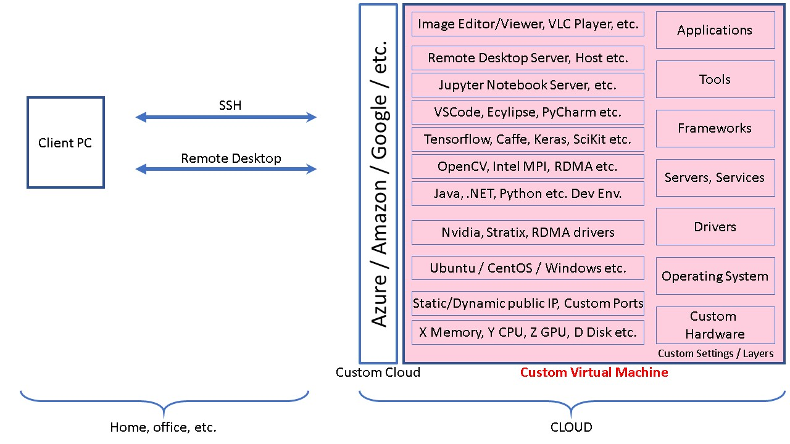

# Custom Data Science Virtual Machine on the Cloud
This project helps to create custom virtual machines on any cloud that you may access remotely. It consist of bash scripts that you can customize to create any tier virtual machine (i.e. X core, Y GPU, Z SSD etc.), install any driver (i.e. NVidia CUDA, Intel Stratix FPGA etc.), install any framework, software or service (i.e. Jupyter Notebook, TensorFlow, OpenCV, Remote Desktop Client/Server, IDE, Image editor etc.), compile them from their sources (i.e. latest openCV, tensorflow with latest nvidia drives, which will take ~3 hours to compile), attach additional new or existing harddisks etc. And you can do all these on any cloud provider like Microsoft Azure, Amazon, Google etc. (for now only Azure)  

Proposed use case of the VM that will be created:
  

**IMPORTANT** in th azure_settings.sh file we set the VM size along with many other parameters.  

vm_size="Standard_NC6s_v3"  

This VM type is single GPU but with the latest GPU model! so it will consume your cloud credits quickly! See [Azure pricing](https://azure.microsoft.com/en-us/pricing/details/virtual-machines/windows/) to see how much credits it will consume from your cloud subscription to not to be surprised later!

## Point in time limitations
- Just Ubuntu 18.0 VM Support
- Just Microsoft Azure Cloud deployment

## Collaboration Request
Feel free to contribute this project by adding support to new OSs, Clouds etc.

## Customization
You may select any of the software bekiw or more in your custom VM deployment:  
1) X2Go Server to enable remote graphical desktop access feature to the VM  
2) Latest NVidia Graphics Card driver to be able to use GPU features  
3) Latest NVidia Cuda, CuDNN, TensorRT, pyCuda libraries  
4) OpenCV (compiled from source specific to installed VM instruction set)  
5) Latest Tensorflow (compiled from source specific to installed VM instruction set)  
6) PyTorch
7) VLC Player
8) Jupyter Notebook server  
9) Chrome Internet Browser  
10) Sublime Text editor  
11) Storage Explorers for managing cloud storage  
12) GPICView Image viewer
13) Visual Studio Code
14) Azure Cloud Storage Explorer
15) ...

# How to run the project to create a custom VM
## Requirements

You may run the project from any Bash shell. Tested platforms:
- Windows 10 with **[Ubuntu on Windows 10 machine](https://docs.microsoft.com/en-us/windows/wsl/install-win10)**.
- Mac OS
- Ubuntu OS

You need to install the following tools on the bash shell:
- Install **[Azure CLI 2.0](https://docs.microsoft.com/en-us/cli/azure/install-azure-cli-apt?view=azure-cli-latest)** in Ubuntu Bash. This will let you access Azure Command Line Interface to create any Azure resource needed.

- dos2unix tool for converting dos line endings to unix (in case you need, i.e. git repo on windows accessed through Win10 bash shell)  

    **sudo apt-get update**  
    **sudo apt-get install dos2unix**  

    after you installed **dos2unix** tool, you may use following command to convert line endings in all files (if needed!)  

    $ dos2unix *

- Azure Subscription: If you dont have an existing one, create an Azure subsctiption. (Can get free trial subscription at: https://azure.microsoft.com/en-us/offers/ms-azr-0044p/)

- NVidia drivers and some other installation files can be downloaded directly from their sources but some of this downloads requires the acceptance of a license aggrement, website subscriptions ets. Also there may be a need to re-create VM several times with different configurations etc. For such reasons we manually download all required installation files and put all them into a cloud storage within the same cloud space with the VM we are creating (or you can put them anywhere that you can access and dowloand by **wget** command). Once you download them and put them in your own application/software repository you dont need to repeat the download operation from their original sources.

    List of the drivers etc. can be found in **source_urls.sh** file. Open this file with a text editor (dont forget to use dos2unix command for this file if you edit it in windows environment) and update all lines to be sure that the file names and their source URLs are correct and accessible.

- Update **source_urls.sh** file so they are accessible from the URLs set in this file. I use [Azure storage explorer](https://docs.microsoft.com/en-us/azure/vs-azure-tools-storage-manage-with-storage-explorer?tabs=windows) to upload manually downloaded drivers etc. to my own applicaton/software repository that I host in Azure Blob Storage. Azure Storage Explorer is available in Unix, Mac and Windows platforms.

- Set .sh files' attributes to be executable  

  $ chmod +x *.sh

- Update **./commons/settings.sh** , **./azure/azure_settings.sh** file contents along with **source_url.sh** file. They contain critical environment variable parameters need to be set accourding to your environment (i.e. Azure subscription ID, scprits path ets.).

## Run the scripts to create your custom VM
Use the following command in your bash shell:  

$ . ./azure_create_dsvm.sh |& tee -a vm_no_X.log  

Above command will run the **azure_create_dsvm.sh** script file which calls chain of other dependent scripts. Terminal window outputs will be written into **vm_no_X.log** text file that you can parse later to see if there is any error. Resulting VM will have static public IP address that you can reach from anywhere.

## Accessing the VM
- **SSH**: Using SSH you can access the VM with following command:  

    $ ssh -i ~/.ssh/$vm_name"_id_rsa" $user_name@$vm_dns_name

    Per VM, we create a specific public/private SSH key. So you will not need a password to access the VM. Private key that we create for this specific VM will be accessed from ".ssh" folder.

    if you want to use SSH from windows environment you may use **[Putty Gen](https://www.ssh.com/ssh/putty/windows/puttygen)**  

- **Remote Desktop**: we install X2GO server on the VM that we created. So you may use **[X2GO client](https://wiki.x2go.org/doku.php/doc:installation:x2goclien)** to remotely access it from supported client OSs like Windows. In our case we use Windows10 OS with X2GO client installated. To access the VM we need the **private SSH key** that we generated while creating the VM through scripts. That private SSH key is stored in your Bash terminal session. So you need to transfer/copy that private key to the host or to the client PC that you will use the X2Go client. So that private SSH key will be accessible from X2GO client. Sample X2GO client config:  

    

    On the X2GO Session config window (sample shown above), dont forget to set the highligted fields with the ones that you use. (only Session type is static value and must be XFCE)

    Here I use Windows10 with Ubuntu Bash installed. While creating the VM through the Ubuntu bash over the Windows 10, my ssh keys are stored in the default location which is: "~/.ssh" or "/home/mustafa/.ssh". I copied the VM specific SSH key from this default location to the host PC accessible folder which is mounted on "/mnt/C" (C drive of the host PC mounted on the Ubuntu Bash on Windows 10)

# NOTES:
- Dots (.) infront of the script file names in the script file contents are important!
    example: . ./run.sh
    Why? Used to pass variables from one shell script to another. 
    Mode details: https://stackoverflow.com/questions/9772036/pass-all-variables-from-one-shellscript-to-another

- This script set compiles Tensorflow from its source with the latest Cuda Toolkit etc. along with VM machine native instruction set for best performance. It compiles and creates 2 python packages (one for Python2.5 other for Python3.5). Compilation will take **\~3 hours!** so be patient. Once you compile, you can upload the resulting packages to your storage folder to download and install directly next time...

